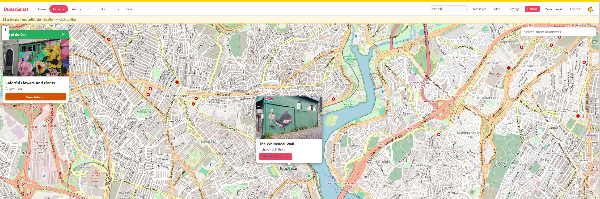
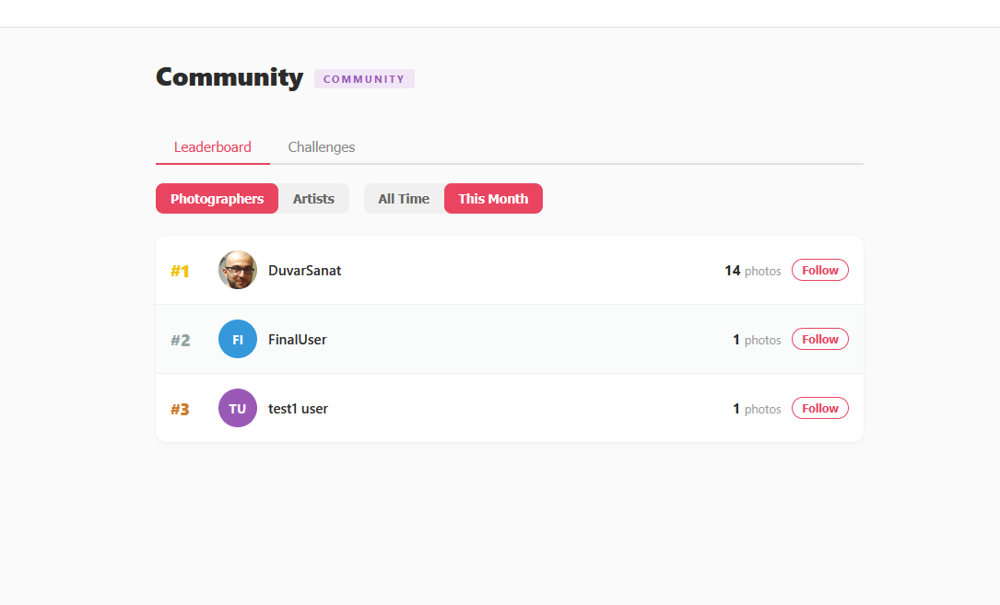
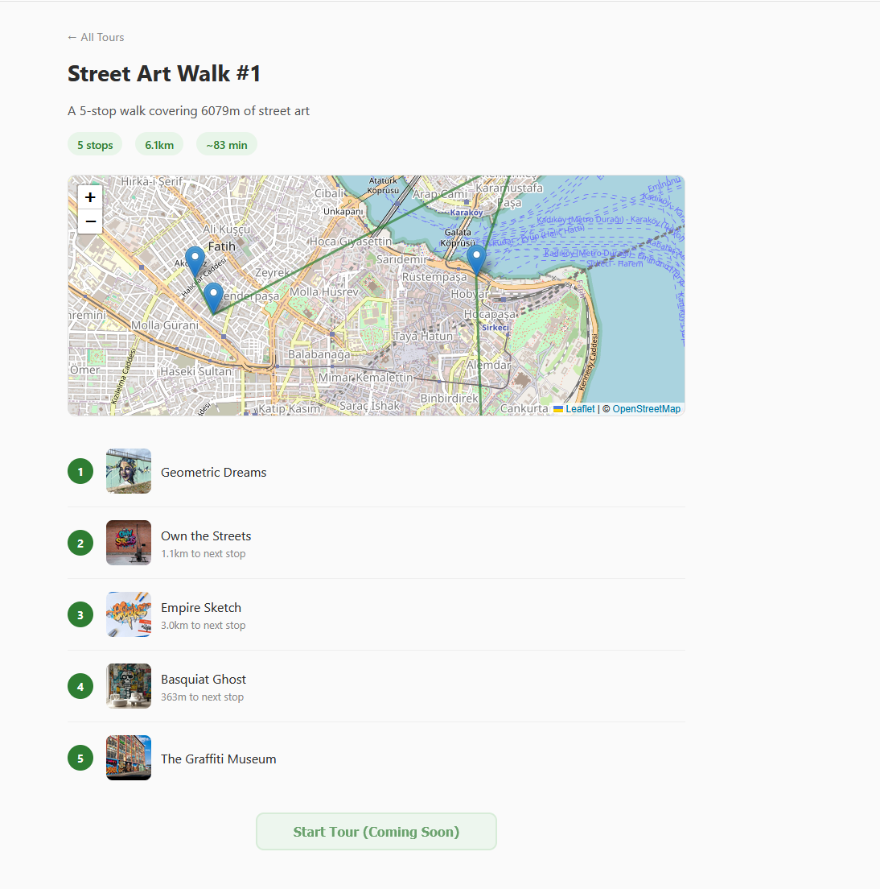
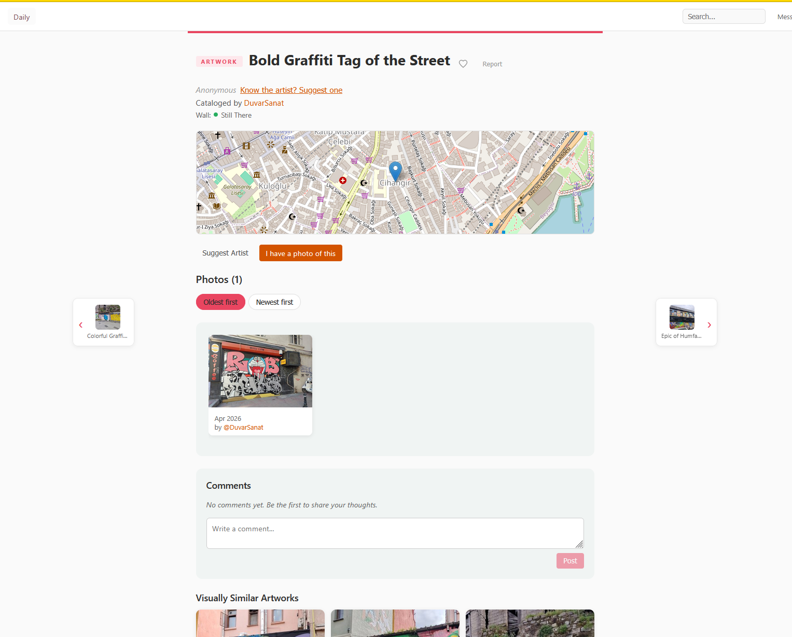
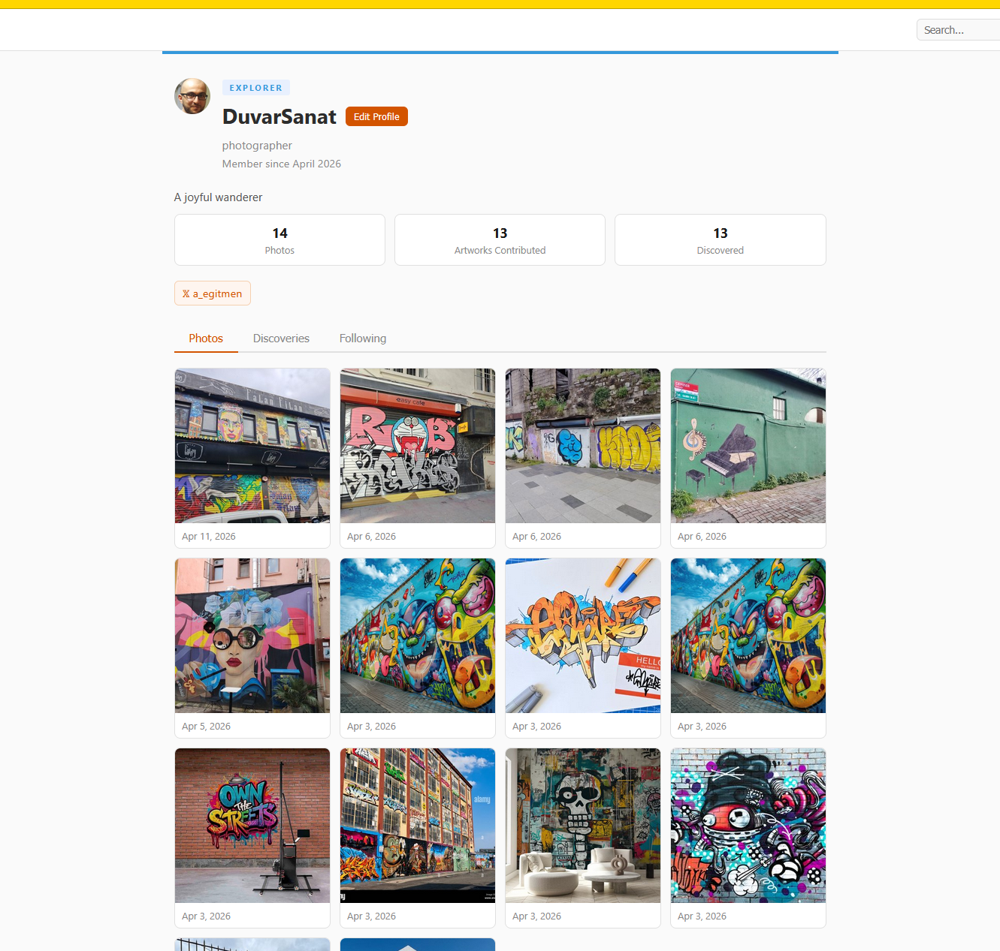

# DuvarSanat

Duvar ve sokak sanatlarının komünite sayesinde kataloglanması amacıyla
yaratılmış; artist, fotoğrafçı ve gezginlerin etkileşime geçebileceği bir web
sitesi olarak düşünülmüştü.

MVP'ler tamamlandıktan sonra hali hazırda yapılmış ve tamamen aynı olan bir
projeye denk gelindiği için ([streetartcities.com](https://streetartcities.com))
proje bırakılmıştır. Mevcut kod çalışır durumdadır ve `docker compose` ile
lokalde ayağa kaldırılıp test edilebilir.

## Özellikler

- **Local AI/ML modelleri (CLIP):** öneri, abuse koruması, benzerlik kontrolü,
  resmi inceleyip isim önerme
- **PWA** (Progressive Web App) uyumlu
- **Açık kaynak, ücretsiz harita** altyapısı (OpenStreetMap)
- **Lokasyon vektörleri** sayesinde işaretlenmiş duvar sanatları arasında
  hızlıca geçiş, rota hesaplama, tur oluşturma, mahalle bazlı hızlı arama
- **Basit DM yapısı**, aktiviteler, badge yönetimi
- **Admin ve moderasyon panelleri**
- **Kalite özellikleri:** oylama, resmi artist ile eşleştirme, artist
  hesabının moderasyon üzerinden sahiplenilmesi, aynı duvar resminin farklı
  versiyonlarının karşılaştırılması

## Ekran Görüntüleri

<table>
  <tr>
    <td></td>
    <td></td>
  </tr>
  <tr>
    <td></td>
    <td></td>
  </tr>
  <tr>
    <td></td>
    <td></td>
  </tr>
</table>

## Lokalde Çalıştırma

```bash
docker compose up --build
```


## Durum

Proje **bırakılmıştır**. Domain satılıktır — iletişim:
[info@crossfirelab.com](mailto:info@crossfirelab.com)
